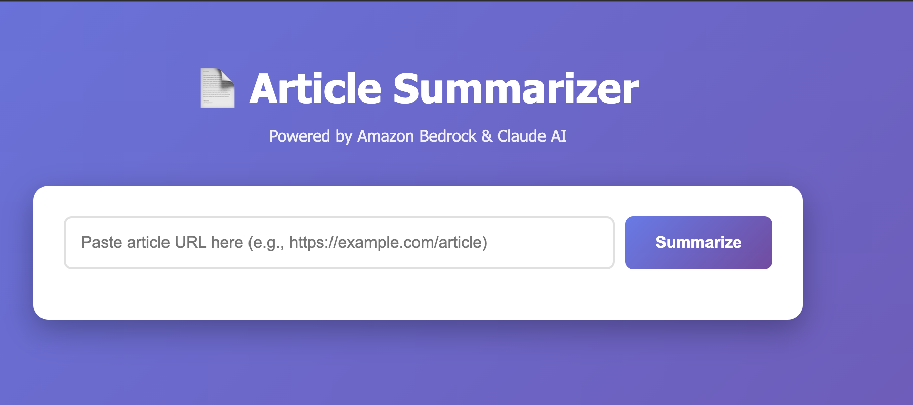
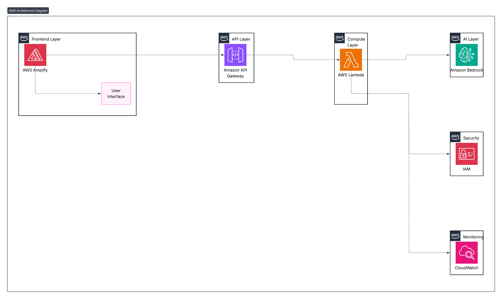

# 📄 AI Article Summarizer

An intelligent web application that summarizes any article URL using AI, built with AWS serverless architecture.

## 🚀 Live Demo

**Website:** [https://main.d3681nbop78byk.amplifyapp.com/]

Try it with any article URL:
- https://www.bbc.com/news
- https://www.theguardian.com/world
- Any blog or news article

## ✨ Features

- 🤖 **AI-Powered Summarization** - Uses Claude 3 Haiku via Amazon Bedrock
- ⚡ **Serverless Architecture** - Scales automatically, zero maintenance
- 🔒 **Secure** - HTTPS by default, IAM-based security
- 💰 **Cost-Effective** - Pay-per-use model (~$0.01-0.02 per summary)
- 🎨 **Modern UI** - Clean, responsive design with loading states

## 🏗️ Architecture

### Components

- **Frontend:** AWS Amplify (Static hosting with auto HTTPS)
- **API:** AWS API Gateway (REST API with CORS)
- **Compute:** AWS Lambda (Python 3.12)
- **AI:** Amazon Bedrock (Claude 3 Haiku)
- **Monitoring:** CloudWatch Logs

### Request Flow

1. User submits article URL through web interface
2. API Gateway receives POST request
3. Lambda function fetches and extracts article text
4. Bedrock AI generates intelligent summary
5. Summary displayed to user (typically 5-10 seconds)
